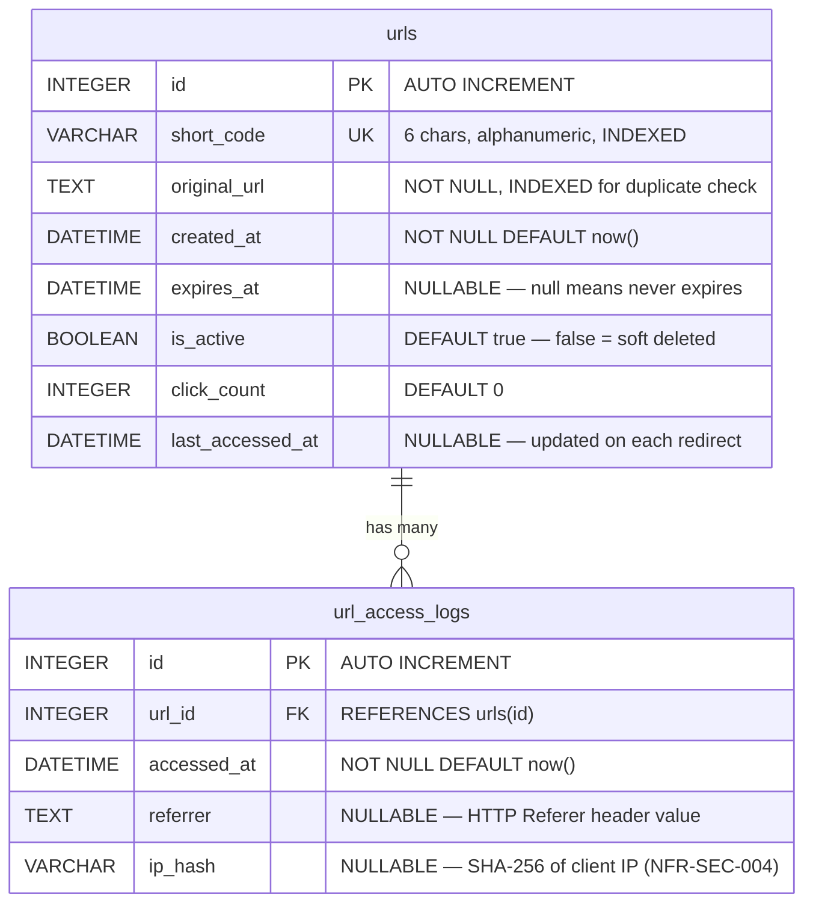

# ER Diagram — URL Shortener Data Model

Covers: REQ-SHORT-003, REQ-ANALY-001, REQ-ANALY-002, REQ-ANALY-003, REQ-EXPRY-001, NFR-SEC-004

---

---

## Field-Level Notes

| Table | Field | Why it exists |
|---|---|---|
| `urls` | `short_code` | The lookup key on every redirect — must be UNIQUE + INDEXED |
| `urls` | `original_url` | Indexed to detect duplicates on POST (REQ-SHORT-004) |
| `urls` | `expires_at` | Nullable — if null, URL lives forever (REQ-EXPRY-001) |
| `urls` | `is_active` | Soft delete flag — allows DELETE without losing analytics history |
| `urls` | `click_count` | Denormalized counter for fast stats reads (REQ-ANALY-001) |
| `urls` | `last_accessed_at` | Updated on every redirect for recency tracking (REQ-ANALY-002) |
| `url_access_logs` | `referrer` | Raw referrer per click event (REQ-ANALY-003) |
| `url_access_logs` | `ip_hash` | Hashed IP — never plaintext per NFR-SEC-004 |

---

## Design Decisions

- **Two-table design**: `urls` holds current state, `url_access_logs` holds history.
  This lets us compute `click_count` from the log table if needed, but we keep
  a denormalized counter in `urls` for O(1) reads on the stats endpoint.

- **Soft delete via `is_active`**: When a URL is "deleted", we set `is_active=false`
  rather than removing the row. This preserves the access log history and prevents
  short code reuse for deleted URLs.

- **SQLite for development**: Simple file-based database. SQLAlchemy ORM means
  we can swap to PostgreSQL in production with no code changes.
