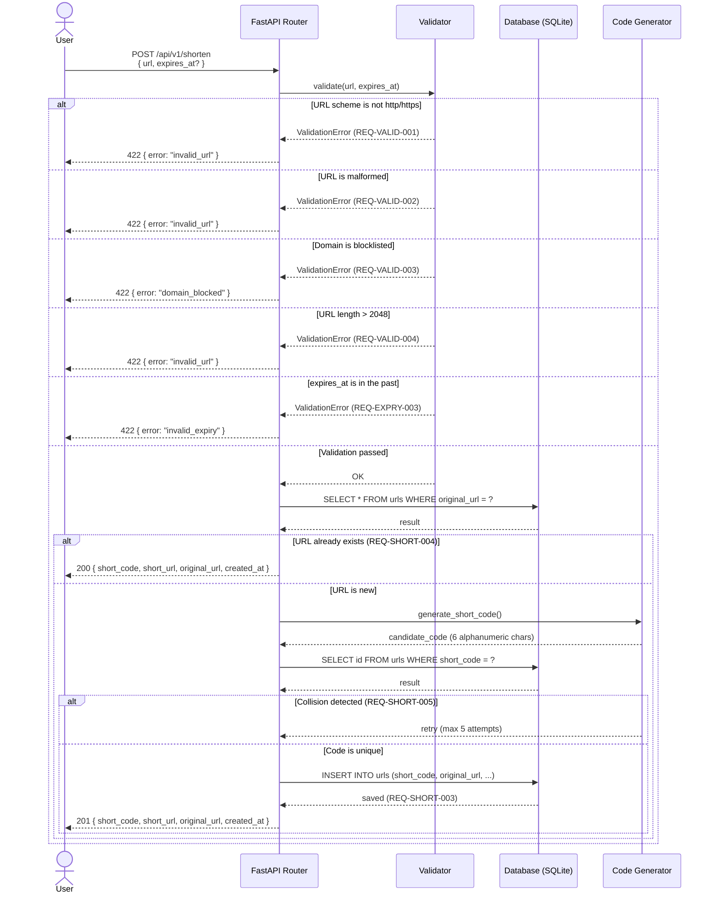
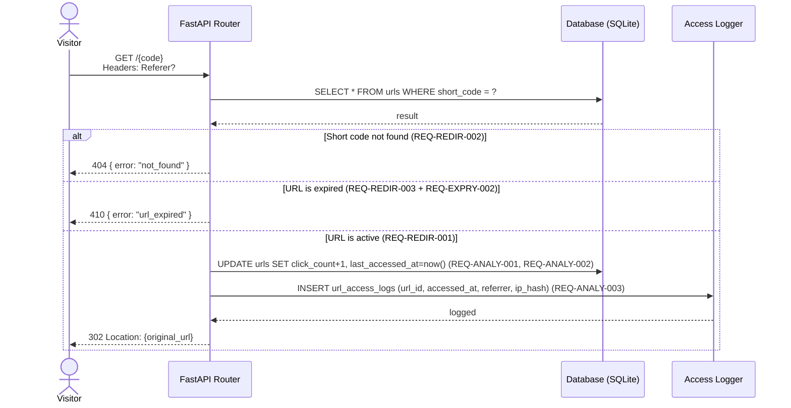
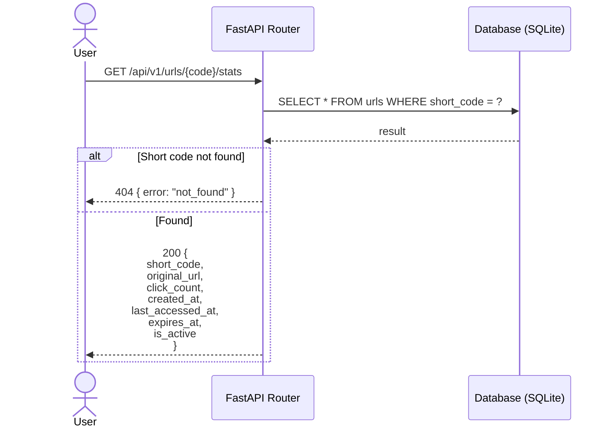

# Sequence Diagrams — URL Shortener Service

---

## 1. URL Shortening Flow (POST /api/v1/shorten)

Covers: REQ-SHORT-001, REQ-SHORT-002, REQ-SHORT-003, REQ-SHORT-004, REQ-SHORT-005, REQ-VALID-001 to REQ-VALID-004

---

## 2. URL Redirect Flow (GET /{code})

Covers: REQ-REDIR-001, REQ-REDIR-002, REQ-REDIR-003, REQ-ANALY-001, REQ-ANALY-002, REQ-ANALY-003, REQ-EXPRY-002

---

## 3. Analytics Retrieval (GET /api/v1/urls/{code}/stats)

Covers: REQ-ANALY-004

