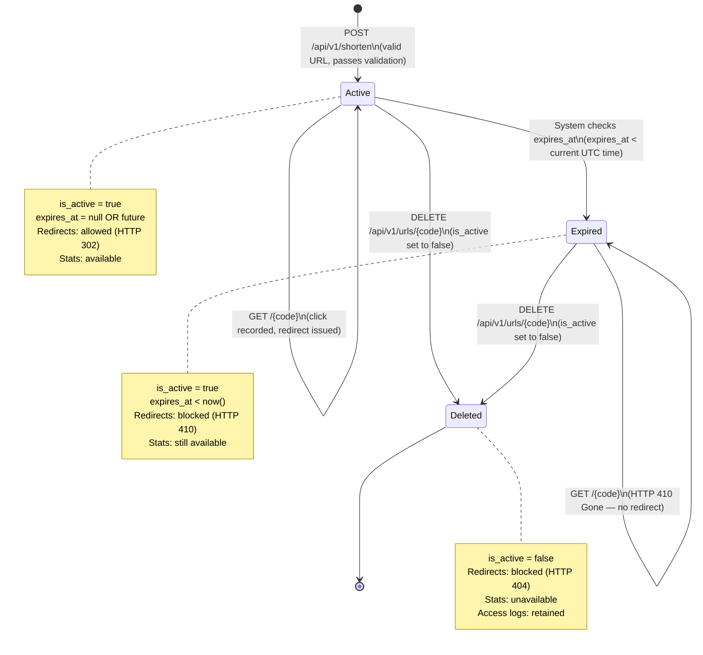

# State Diagram — URL Lifecycle

Covers: REQ-EXPRY-001, REQ-EXPRY-002, REQ-REDIR-003, REQ-REDIR-002

---

---

## State Transition Table

| From State | Trigger | To State | HTTP Behavior |
|---|---|---|---|
| `[new]` | POST /shorten (valid) | `Active` | 201 Created |
| `[new]` | POST /shorten (invalid) | `[rejected]` | 422 Unprocessable |
| `Active` | GET /{code} | `Active` | 302 Redirect |
| `Active` | expires_at passes | `Expired` | (automatic, no API call) |
| `Active` | DELETE /{code} | `Deleted` | 200 OK |
| `Expired` | GET /{code} | `Expired` | 410 Gone |
| `Expired` | DELETE /{code} | `Deleted` | 200 OK |
| `Deleted` | GET /{code} | `Deleted` | 404 Not Found |

---

## Key Design Notes

- **Expiry is evaluated lazily** — there is no background job. Each GET /{code}
  request checks `expires_at` at runtime. This is simpler and sufficient for this scope.

- **Deletion is a soft-delete** — `is_active` is set to `false`. The row is never
  removed. This preserves the `url_access_logs` history and prevents short code
  reuse for deleted records.

- **Expired ≠ Deleted** — an expired URL returns 410 (Gone), a deleted URL returns
  404 (Not Found). These are semantically different: 410 means "it existed but is
  gone permanently", 404 means "we don't recognize this code."
