# Development Workflow: Ticket Pickup to Deploy

> **Project:** flask-realworld-example-app (Conduit API)
> **Stack:** Flask · PostgreSQL/SQLite · CircleCI · Heroku · Pipenv

---

## Mermaid Flowchart

```mermaid
flowchart TD
    A([🎫 Pick Up Ticket]) --> B[Clone / Sync Repo\ngit pull origin master]
    B --> C[Provision Dev Environment\nVagrant up  OR  pipenv install --dev]
    C --> D[Export Env Vars\nFLASK_APP=autoapp.py\nFLASK_DEBUG=1\nCONDUIT_SECRET=...]
    D --> E[Apply DB Migrations\nflask db upgrade]
    E --> F[Create Feature Branch\ngit checkout -b feature/TICKET-123]
    F --> G[Write / Edit Code\nBlueprints · Models · Serializers · Views]
    G --> H[Run Linter Manually\nflask lint  /  flask lint --fix-imports]
    H --> I{Lint Pass?}
    I -- No --> G
    I -- Yes --> J[Write / Update Tests\npytest in tests/]
    J --> K[Run Test Suite\nflask test]
    K --> L{Tests Pass?}
    L -- No --> G
    L -- Yes --> M[Create DB Migration if schema changed\nflask db migrate  →  flask db upgrade]
    M --> N[Commit Changes\ngit add . && git commit -m '...']
    N --> O[Push Branch\ngit push origin feature/TICKET-123]
    O --> P[Open Pull Request\nGitHub PR against master]
    P --> Q[CI Pipeline Triggered\nCircleCI / Travis CI]
    Q --> R[CI: Install Dev Deps\npip install -r requirements/dev.txt]
    R --> S[CI: Set Env Vars\nFLASK_APP / FLASK_DEBUG]
    S --> T[CI: Run flask test]
    T --> U{CI Pass?}
    U -- No → fix --> G
    U -- Yes --> V[Code Review\nManual peer review on GitHub]
    V --> W{Review Approved?}
    W -- Changes requested --> G
    W -- Approved --> X[Merge PR to master\nGitHub merge button]
    X --> Y[Deploy to Heroku\ngit push heroku master  OR  auto-deploy]
    Y --> Z[Heroku: gunicorn starts\nautoapp:app -b 0.0.0.0:PORT -w 3]
    Z --> AA[Run prod DB migrations\nheroku run flask db upgrade]
    AA --> AB([✅ Feature Live in Production])

    style A fill:#4A90D9,color:#fff,stroke:#2c6fad
    style AB fill:#27AE60,color:#fff,stroke:#1e8449
    style I fill:#F39C12,color:#fff,stroke:#b7770d
    style L fill:#F39C12,color:#fff,stroke:#b7770d
    style U fill:#F39C12,color:#fff,stroke:#b7770d
    style W fill:#F39C12,color:#fff,stroke:#b7770d
```



---

## Step-by-Step Annotations

| # | Step | Time Spent | Tools Used | Pain Points |
|---|------|-----------|------------|-------------|
| 1 | **Pick Up Ticket** | 5–15 min | GitHub Issues / Jira / Linear | Vague acceptance criteria; missing context on related PRs |
| 2 | **Clone / Sync Repo** | 1–3 min | `git pull`, `git fetch` | Merge conflicts if master diverged while working |
| 3 | **Provision Dev Environment** | 5–30 min (first run: 10–30 min) | Vagrant + VirtualBox **or** Pipenv (`pipenv install --dev`) | `Vagrantfile` targets Ubuntu 18.04 + Python 3.7 — VirtualBox version conflicts are common; `pipenv` can be slow resolving `Pipfile.lock`; no Docker path exists |
| 4 | **Export Env Vars** | 2–5 min | Shell exports / `.env` file | No `.env.example` or dotenv loader — devs must know the three required vars (`FLASK_APP`, `FLASK_DEBUG`, `CONDUIT_SECRET`); `settings.py` has a `TODO` comment about `CONDUIT_SECRET` |
| 5 | **Apply DB Migrations** | 1–3 min | `flask db upgrade` (Flask-Migrate / Alembic) | Dev uses SQLite by default — subtle differences vs. PostgreSQL (e.g., missing `ALTER COLUMN`) can mask prod migration failures |
| 6 | **Create Feature Branch** | < 1 min | `git checkout -b` | No enforced branch naming convention in repo |
| 7 | **Write / Edit Code** | Hours–days | VS Code / PyCharm, Flask Blueprints, SQLAlchemy, Marshmallow, flask-apispec | Blueprint boilerplate is verbose; Marshmallow 2→3 migration already caused bugs (PR #26); SQLAlchemy `AppenderQuery` deprecation hit in PR #27 |
| 8 | **Run Linter Manually** | 1–5 min | `flask lint` (flake8, max-line 120), `flask lint --fix-imports` (isort) | **No pre-commit hook** — linting is manual, so dirty commits reach CI regularly; isort flag is non-obvious |
| 9 | **Write / Update Tests** | 30 min–2 hrs | pytest, WebTest, factory-boy, Faker, in-memory SQLite | Test DB is SQLite but prod is PostgreSQL — divergence risk; `factory-boy` sequences can collide across test sessions if not reset |
| 10 | **Run Test Suite Locally** | 1–5 min | `flask test` (pytest under the hood) | One known failing test exists (noted in commit `4464881`) — noisy baseline makes it harder to spot new failures |
| 11 | **Create DB Migration** | 5–15 min | `flask db migrate`, `flask db upgrade` | Auto-generated migration scripts need manual review (Alembic cannot detect all changes); SQLite dev env silently skips unsupported DDL |
| 12 | **Commit & Push** | 2–5 min | `git commit`, `git push` | No commit-message linter or template; no pre-push hook to gate on tests |
| 13 | **Open Pull Request** | 5–10 min | GitHub PR UI | No PR template or checklist in the repo |
| 14 | **CI Pipeline** | 3–8 min | CircleCI (python:3.6.0 image) and/or Travis CI | CI uses Python 3.6 while `Pipfile` targets 3.7 — version skew; Travis CI config tests 2.7/3.4/3.5/3.6 (EOL versions); no caching of pip dependencies in CircleCI config → slow cold installs |
| 15 | **Code Review** | 30 min–1 day | GitHub PR review | Sole bottleneck if team is small; no CODEOWNERS or review assignment automation |
| 16 | **Merge to master** | < 1 min | GitHub merge button | No branch protection rules documented; merge vs. squash strategy undefined |
| 17 | **Deploy to Heroku** | 2–5 min (auto) or manual push | `git push heroku master`, Heroku buildpacks, gunicorn | No zero-downtime release steps; post-deploy migration (`heroku run flask db upgrade`) is manual and undocumented |
| 18 | **Prod DB Migration** | 1–3 min | `heroku run flask db upgrade` | Runs synchronously via one-off dyno — migrations that take > 30s can time out; no rollback strategy documented |
| 19 | **Feature Live** | — | Heroku dynos, gunicorn (3 workers) | No health-check or smoke-test step after deploy; no monitoring/alerting configured in repo |

---

## Key Pain Points Summary

1. **No pre-commit hooks** — linting and tests are opt-in, so broken code routinely reaches CI.
2. **SQLite (dev) vs. PostgreSQL (prod) mismatch** — masks migration and query bugs locally.
3. **Python version skew** — Pipfile says 3.7, CircleCI image is 3.6, Travis tests EOL versions.
4. **Manual env-var setup** — no `.env.example`, no dotenv loader, one undocumented `TODO` in settings.
5. **No PR / commit templates** — inconsistent review quality and commit history.
6. **No post-deploy smoke test** — a bad deploy may go undetected until a user hits an error.
7. **Dependency resolution slowness** — Pipenv lock resolution with no CI cache layer adds minutes.
8. **Known failing test in baseline** — a pre-existing red test makes regression detection harder.
```
