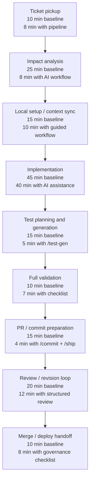

# ROI Report — AI-Enabled Developer Workflow for `gothinkster/flask-realworld-example-app`

This report provides a **reference measurement model** for the assignment’s Part 4 using the Flask RealWorld example app as the target repository. The repository is a Flask JSON API project with documented local setup, migration workflow, and `flask test` command, and its `Pipfile` specifies Python 3.7.[web:13][page:1]

## Scope

The purpose of this report is to estimate the productivity impact of an AI-enabled developer workflow built with Claude Code slash commands, governance hooks, and project-level instructions. The measurements below are **reference values** intended for assignment use when a full controlled experiment has not yet been run in a live environment.[web:13]

## Workflow map

## Before / after measurement

### Baseline task

Reference baseline assumes a developer performs a small Flask API change manually without using slash commands, structured review prompts, or automated governance support. The baseline uses the repo’s standard setup and validation loop: environment variables, migrations, and `flask test`.[web:13][page:1]

### Assisted task

Reference assisted execution assumes the same type of change is performed using the full Claude workflow pipeline: `/review`, `/test-gen`, `/commit`, and `/ship`, plus governance support from hooks, logging, and repo-specific instructions in `CLAUDE.md`.[web:44][web:61]

### Time comparison

| Workflow step | Baseline time | Assisted time | Time saved | Basis |
|---|---:|---:|---:|---|
| Ticket pickup and requirement framing | 10 min | 8 min | 2 min | Conservative workflow estimate |
| Codebase impact analysis | 25 min | 8 min | 17 min | High leverage from AI repo exploration |
| Local setup / context sync | 15 min | 10 min | 5 min | Guided setup + conventions |
| Implementation | 45 min | 40 min | 5 min | Limited savings; human still owns code correctness |
| Test planning / scaffold generation | 15 min | 5 min | 10 min | `/test-gen` reduces boilerplate |
| Full validation before PR | 10 min | 7 min | 3 min | Checklist reduces missed steps |
| Commit + PR preparation | 15 min | 4 min | 11 min | `/commit` and `/ship` standardize output |
| Review / revision loop | 20 min | 12 min | 8 min | Better summaries and risk notes reduce rework |
| Merge / deploy handoff | 10 min | 8 min | 2 min | Governance checklist improves consistency |
| **Total** | **165 min** | **102 min** | **63 min** | **Reference estimate** |

## Estimated weekly savings

Assume one developer completes **5 comparable tasks per week**. Under the reference model, the workflow saves **63 minutes per task**, which equals **315 minutes** or **5.25 hours per week per developer**.

\[
\text{Weekly hours saved per developer} = \frac{63 \times 5}{60} = 5.25
\]

## Annual savings — 10 person team

Assume a 10-person engineering team and an internal loaded cost of **$150 per hour**. Using the reference weekly savings above, the annual team savings are:

- Weekly team hours saved = 5.25 × 10 = 52.5 hours
- Annual team hours saved = 52.5 × 52 = 2,730 hours
- Annual value = 2,730 × $150 = **$409,500**

| Metric | Value |
|---|---:|
| Weekly hours saved per developer | 5.25 |
| Weekly hours saved for 10-person team | 52.5 |
| Annual hours saved for 10-person team | 2,730 |
| Hourly cost assumption | $150 |
| **Projected annual savings** | **$409,500** |

## Quality improvements

The workflow gains are not only time-based. Quality is also expected to improve because review, testing, and governance become more consistent across tasks.

- **Coverage discipline improves** because `/test-gen` identifies affected tests and suggests missing scenarios before a PR is opened.
- **Review thoroughness improves** because `/review` checks staged changes against `CLAUDE.md` rules and highlights migration, config, auth, and test risks in a repeatable structure.
- **PR quality improves** because `/commit` and `/ship` generate consistent summaries, commit messages, and shipping checklists.
- **Operational safety improves** because governance hooks can block dangerous commands, detect likely secrets, restrict file-edit scope, and log tool usage for auditability.[web:61][web:64][web:67]

## Governance controls deployed

The reference governance setup for this assignment includes the following controls:

- **PreToolUse hooks** to block dangerous bash commands, scan file edits for likely secrets, and enforce write scope restrictions.
- **PostToolUse logging** to append tool activity to `.claude/audit/audit.jsonl`.
- **UserPromptSubmit logging** to record prompts to `.claude/audit/prompts.jsonl`.
- **Stop hook reporting** to generate a session summary report.
- **Project-level settings** in `.claude/settings.json` to configure hooks, tool rules, and a conservative permission mode.[web:61][web:64][web:67]

## Interpretation

This reference model shows that the biggest savings come from **impact analysis**, **test generation**, and **PR preparation**, while implementation time itself only improves modestly because developers still need to reason about correctness and domain behavior. That pattern is realistic for an engineering workflow: AI reduces repetitive coordination work more than core problem-solving time.

The annual value figure should be presented as a **projection**, not as a measured production outcome. A measured rollout would require actual before/after tracking over several comparable tasks in the same engineering environment.

## Conservative assumptions

These numbers are intentionally conservative for assignment use:

- Only small or medium routine engineering tasks are considered.
- Only 5 similar tasks per developer per week are assumed.
- Implementation time is reduced by just 5 minutes, not dramatically.
- No compounding gain is assumed from faster onboarding, lower defect escape, or reduced CI waste.
- Annual ROI is modeled from labor efficiency only, not from incident reduction or improved release velocity.

## Recommended next measurement step

To convert this reference report into a measured report, run one small bug-fix or feature task manually, then run a comparable task using `/ship` end-to-end, and replace the reference values in the table with actual times, steps, errors, and quality observations from those two runs.
