# Workflow Map — Conduit (flask-realworld-example-app)

> **Evidence key**
> - ✅ Verified — observed directly in repo files (code, config, commit history)
> - ⚠️ Inferred — reasonable assumption about typical Flask/GitHub OSS workflow; not provable from files alone

---

## 1. Refined development workflow

```mermaid
flowchart TD
    subgraph SETUP["SETUP (once per dev / per sprint)"]
        A([Ticket assigned]) --> B["Sync repo\ngit pull origin master"]
        B --> C{"First time\non machine?"}
        C -- Yes --> D["Provision env\npipenv install --dev\n✅ Vagrantfile alt. exists"]
        C -- No --> E["Activate env\npipenv shell"]
        D --> F["Export env vars manually\nFLASK_APP · FLASK_DEBUG · CONDUIT_SECRET\n✅ No .env.example exists"]
        E --> F
        F --> G["Apply pending migrations\nflask db upgrade\n✅ SQLite in dev — not PostgreSQL"]
    end

    subgraph DEVELOP["DEVELOP (iterative, many cycles)"]
        G --> H["Create feature branch\ngit checkout -b feature/…\n⚠️ No naming convention enforced"]
        H --> I["Write / edit code\nBlueprints · Models · Serializers · Views"]
        I --> J["Run linter manually\nflask lint  /  flask lint --fix-imports\n✅ No pre-commit hook"]
        J --> K{Lint\nclean?}
        K -- No --> I
        K -- Yes --> L["Write / update tests\nWebTest · pytest · factory-boy"]
        L --> M["Run test suite\nflask test\n✅ 1 known failing test in baseline"]
        M --> N{All\ntests pass?}
        N -- No --> I
        N -- Yes --> O{"Schema\nchanged?"}
        O -- Yes --> P["Generate migration\nflask db migrate\nflask db upgrade\n✅ Alembic cannot detect all DDL"]
        O -- No --> Q
        P --> Q["Commit\ngit commit -m '…'\n⚠️ No message template"]
        Q --> R["Push branch\ngit push origin feature/…"]
    end

    subgraph REVIEW["REVIEW"]
        R --> S["Open Pull Request\nGitHub · no PR template ✅"]
        S --> T["CI triggered\n✅ CircleCI python:3.6 image\n✅ Pipfile targets Python 3.7\n✅ No pip cache in CI config"]
        T --> U{CI\ngreen?}
        U -- No, fix --> I
        U -- Yes --> V["Peer code review\n⚠️ No CODEOWNERS · no auto-assign"]
        V --> W{Approved?}
        W -- Changes --> I
        W -- Yes --> X["Merge to master\n⚠️ Merge vs squash undefined"]
    end

    subgraph DEPLOY["DEPLOY"]
        X --> Y["Deploy to Heroku\ngit push heroku master\n✅ Procfile: gunicorn 3 workers"]
        Y --> Z{"Schema\nchanged?"}
        Z -- Yes --> AA["Run prod migration manually\nheroku run flask db upgrade\n✅ No automation · can time out"]
        Z -- No --> AB
        AA --> AB["Feature live\n⚠️ No smoke test · no health check"]
    end

    style SETUP fill:#EBF5FB,stroke:#2E86C1
    style DEVELOP fill:#EAFAF1,stroke:#1E8449
    style REVIEW fill:#FEF9E7,stroke:#B7950B
    style DEPLOY fill:#FDEDEC,stroke:#C0392B
    style A fill:#2E86C1,color:#fff,stroke:#1A5276
    style AB fill:#1E8449,color:#fff,stroke:#145A32
    style K fill:#F39C12,color:#fff,stroke:#9A6A04
    style N fill:#F39C12,color:#fff,stroke:#9A6A04
    style U fill:#E74C3C,color:#fff,stroke:#922B21
    style W fill:#F39C12,color:#fff,stroke:#9A6A04
```

---

## 2. Workflow step scoring

**Scale definitions**

| Dimension | 1 | 2 | 3 | 4 | 5 |
|-----------|---|---|---|---|---|
| **Frequency** | Once per project | Once per sprint | Once per PR | Multiple per PR | Multiple per day |
| **AI Capability** | Cannot help | Minimal assist | Partial automation | Strong assist | Full automation |

**ROI Score** (1–10) = composite of frequency × AI capability, weighted by time cost and pain-point severity. Scores above 7 are primary targets.

> Where a range is given for time, the midpoint is used for scoring. All time estimates marked ⚠️ are inferred from typical Flask OSS workflows; ✅ marks are derived from repo evidence.

| # | Workflow Step | Evidence | Frequency (1–5) | Time / Occurrence | AI Capability (1–5) | ROI Score |
|---|--------------|----------|:-:|---|:-:|:-:|
| 1 | Pick up ticket, read context | ⚠️ | 3 | 5–15 min | 3 — can summarise diff/history | 4 |
| 2 | Sync repo (`git pull`) | ⚠️ | 4 | 1–2 min | 1 — mechanical | 1 |
| 3 | Provision / activate env | ✅ Vagrantfile + Pipfile present | 2 | 5–30 min (first run) | 2 — can generate setup script | 3 |
| 4 | Export env vars manually | ✅ No `.env.example`; `CONDUIT_SECRET` TODO in settings.py | 4 | 2–5 min | 4 — can generate `.env.example` + loader | 6 |
| 5 | Apply dev migrations | ✅ SQLite default; `flask db upgrade` | 3 | 1–3 min | 2 — mechanical shell step | 2 |
| 6 | Create feature branch | ⚠️ | 3 | < 1 min | 1 | 1 |
| 7 | Write / edit source code | ✅ Blueprint structure verified | 3 | 2–8 hrs | 5 — knows project patterns | **9** |
| 8 | Run linter manually | ✅ No pre-commit hook; `flask lint` command exists | 5 | 1–5 min per cycle | 5 — can auto-fix + enforce at commit | **8** |
| 9 | Write / update tests | ✅ WebTest + pytest + factory-boy pattern verified | 3 | 30–120 min | 4 — can scaffold from existing patterns | **8** |
| 10 | Run test suite locally | ✅ `flask test` command; 1 known failing test | 4 | 1–3 min | 1 — just executes | 2 |
| 11 | Generate DB migration | ✅ Flask-Migrate; Alembic cannot detect all DDL | 2 | 5–15 min | 3 — can review generated script | 4 |
| 12 | Commit (write message) | ⚠️ No commit template in repo | 4 | 2–4 min | 4 — can draft from diff | 6 |
| 13 | Write PR description | ✅ No PR template file in repo | 3 | 5–10 min | 5 — can generate from diff + commits | **8** |
| 14 | Wait for CI | ✅ CircleCI config; no pip cache; Python 3.6 vs 3.7 skew | 3 | 3–8 min | 2 — can diagnose failures | 3 |
| 15 | Code review | ✅ No CODEOWNERS; no auto-assign | 3 | 30–480 min | 4 — can pre-review before human reviewer | **7** |
| 16 | Merge PR | ⚠️ | 3 | < 1 min | 1 | 1 |
| 17 | Deploy to Heroku | ✅ Procfile present; manual push documented | 3 | 2–5 min | 2 — mechanical | 2 |
| 18 | Run prod migration manually | ✅ No automation; one-off dyno risk | 2 | 1–3 min | 3 — can generate checklist + reminder | 4 |
| 19 | Post-deploy smoke check | ✅ No health-check config in repo | 3 | 0 (skipped) — risk | 4 — can generate smoke-test script | 6 |
